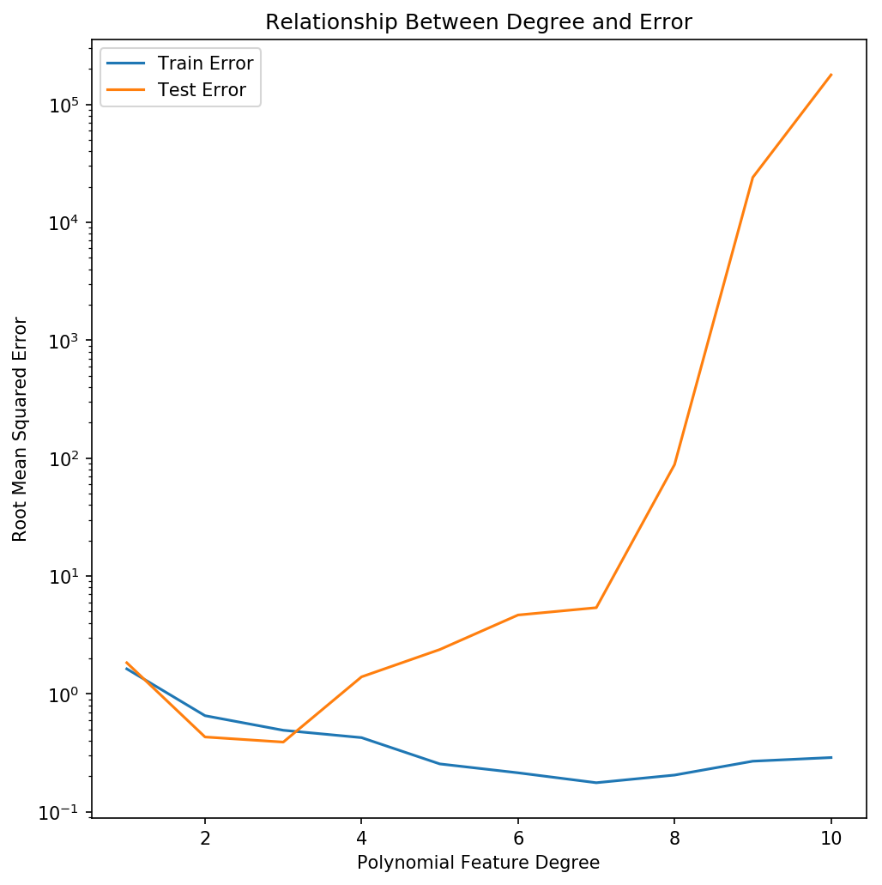

# Regularization

Today you'll be creating several different linear regression models in a predictive machine learning context.

In the cells below, we are importing relevant modules that you might need later on. We also load and prepare the dataset for you.


```python
# Run this cell without changes
import pandas as pd
import itertools
import seaborn as sns
import matplotlib.pyplot as plt
%matplotlib inline
import numpy as np
from sklearn.linear_model import Lasso, Ridge
from sklearn.metrics import mean_squared_error
from sklearn.linear_model import LinearRegression
from sklearn.model_selection import train_test_split
from sklearn.preprocessing import PolynomialFeatures
```


```python
# Run this cell without changes
data = pd.read_csv('raw_data/advertising.csv').drop('Unnamed: 0',axis=1)
data.describe()
```


```python
# Run this cell without changes
X = data.drop('sales', axis=1)
y = data['sales']
```


```python
# Run this cell without changes
# splits the data into training and testing set. Do not change the random state please!
X_train , X_test, y_train, y_test = train_test_split(X, y,random_state=2019)
```


```python
### BEGIN SOLUTION


from test_scripts.test_class import Test
test = Test()

# split the data into training and testing set. Do not change the random state please!
X_train , X_test, y_train, y_test = train_test_split(X, y,random_state=2019)

test.save()


### END SOLUTION
```


```python
# PUT ALL WORK FOR THE ABOVE QUESTION ABOVE THIS CELL
# THIS UNALTERABLE CELL CONTAINS HIDDEN TESTS

### BEGIN HIDDEN TESTS

from test_scripts.test_class import Test
test = Test()

test.run_test()


### END HIDDEN TESTS
```

### 1. We'd like to add a bit of complexity to the model created in the example above, and we will do it by adding some polynomial terms. Write a function to calculate train and test error for different polynomial degrees.

This function should:
* take `degree` as a parameter that will be used to create polynomial features to be used in a linear regression model
* create a PolynomialFeatures object for each degree and fit a linear regression model using the transformed data
* calculate the mean square error for each level of polynomial
* return the `train_error` and `test_error` 


```python
### BEGIN SOLUTION


from test_scripts.test_class import Test
test = Test()


# do a polynomial regression
def polynomial_regression(degree):
    """
    Calculate train and test error for a linear regression with polynomial features.
    (Hint: use PolynomialFeatures)
    
    input: Polynomial degree
    output: Mean squared error for train and test set
    """
    poly = PolynomialFeatures(degree=degree,interaction_only=False)
    X_poly_train = poly.fit_transform(X_train)
    X_poly_test = poly.transform(X_test)
    lr_poly = LinearRegression()
    lr_poly.fit(X_poly_train,y_train)
    train_error = mean_squared_error(y_train, lr_poly.predict(X_poly_train))
    test_error = mean_squared_error(y_test, lr_poly.predict(X_poly_test))
    return train_error, test_error

test.save()


### END SOLUTION
```


```python
# PUT ALL WORK FOR THE ABOVE QUESTION ABOVE THIS CELL
# THIS UNALTERABLE CELL CONTAINS HIDDEN TESTS

### BEGIN HIDDEN TESTS

from test_scripts.test_class import Test
test = Test()

test.run_test()


### END HIDDEN TESTS
```

#### Try out your new function


```python
# Run this cell without changes
polynomial_regression(3)
```


```python
# Run this cell without changes
polynomial_regression(4)
```

#### Check your answers

Approximate MSE for degree 3:
- Train: 0.242
- Test: 0.153

Approximate MSE for degree 4:
- Train: 0.182
- Test: 1.95

### 2. What is the optimal number of degrees for our polynomial features in this model? In general, how does increasing the polynomial degree relate to the Bias/Variance tradeoff?  (Note that this graph shows RMSE and not MSE.)



<!---
fig, ax = plt.subplots(figsize=(7, 7))
degree = list(range(1, 10 + 1))
ax.plot(degree, error_train[0:len(degree)], "-", label="Train Error")
ax.plot(degree, error_test[0:len(degree)], "-", label="Test Error")
ax.set_yscale("log")
ax.set_xlabel("Polynomial Feature Degree")
ax.set_ylabel("Root Mean Squared Error")
ax.legend()
ax.set_title("Relationship Between Degree and Error")
fig.tight_layout()
fig.savefig("visuals/rsme_poly.png",
            dpi=150,
            bbox_inches="tight")
--->


```python
### BEGIN SOLUTION


from test_scripts.test_class import Test
test = Test()

# The optimal number of features in this example is 3 because the testing error 
# is minimized at this point, and it increases dramatically with a higher degree polynomial. 
# As we increase the polynomial features, it is going to cause our training error to decrease, 
# which decreases the bias but increases the variance (the testing error increases). 
# In other words, the more complex the model, the higher the chance of overfitting.

test.save()


### END SOLUTION
```


```python
# PUT ALL WORK FOR THE ABOVE QUESTION ABOVE THIS CELL
# THIS UNALTERABLE CELL CONTAINS HIDDEN TESTS

### BEGIN HIDDEN TESTS

from test_scripts.test_class import Test
test = Test()

test.run_test()


### END HIDDEN TESTS
```

### 3. In general what methods would you can use to reduce overfitting and underfitting? Provide an example for both and explain how each technique works to reduce the problems of underfitting and overfitting.


```python
### BEGIN SOLUTION


from test_scripts.test_class import Test
test = Test()

# Overfitting: Regularization. With regularization, more complex models are penalized. 
# This ensures that the models are not trained to too much "noise."

# Underfitting: Feature engineering. By adding additional features, you enable your 
# machine learning models to gain insights about your data.

test.save()


### END SOLUTION
```


```python
# PUT ALL WORK FOR THE ABOVE QUESTION ABOVE THIS CELL
# THIS UNALTERABLE CELL CONTAINS HIDDEN TESTS

### BEGIN HIDDEN TESTS

from test_scripts.test_class import Test
test = Test()

test.run_test()


### END HIDDEN TESTS
```

### 4. What is the difference between the two types of regularization for linear regression?


```python
### BEGIN SOLUTION


from test_scripts.test_class import Test
test = Test()

# L1 or Lasso Regression adds a term to the cost function which reduces some smaller weights down to zero.
# L2 or Ridge Regression adds a term to the cost function which penalizes weights based on their size,
# bringing all of them closer to zero.

test.save()


### END SOLUTION
```


```python
# PUT ALL WORK FOR THE ABOVE QUESTION ABOVE THIS CELL
# THIS UNALTERABLE CELL CONTAINS HIDDEN TESTS

### BEGIN HIDDEN TESTS

from test_scripts.test_class import Test
test = Test()

test.run_test()


### END HIDDEN TESTS
```

### 5. Why is scaling input variables a necessary step before regularization?


```python
### BEGIN SOLUTION


from test_scripts.test_class import Test
test = Test()

# Regularization adjusts feature weights depending on their magnitude.
# Feature weights themselves depend on both the feature importance and the magnitude of the input variable.
# Therefore, it's important to control for the magnitude of the input variable by scaling all features the same.

test.save()


### END SOLUTION
```


```python
# PUT ALL WORK FOR THE ABOVE QUESTION ABOVE THIS CELL
# THIS UNALTERABLE CELL CONTAINS HIDDEN TESTS

### BEGIN HIDDEN TESTS

from test_scripts.test_class import Test
test = Test()

test.run_test()


### END HIDDEN TESTS
```
